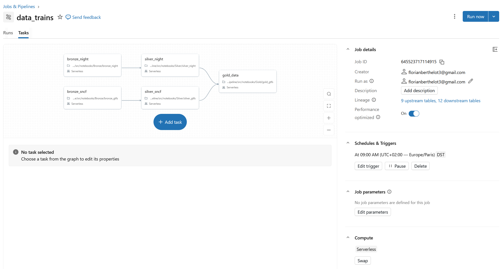

# GTFS Transit Pipeline — Databricks

Pipeline de données pour l'analyse des horaires ferroviaires SNCF et des trains de nuit européens, construit sur Databricks avec Delta Lake.

## Section Contexte / Objectif

Ce projet est né d'un besoin simple : savoir rapidement où l'on peut aller en train depuis chez soi.  

Deux cas d'usage concrets :  
 - Organiser un weekend — visualiser en un coup d'œil toutes les destinations accessibles en liaison directe depuis une gare, sans passer des heures sur des sites de réservation  
 - Planifier un voyage en train de nuit — les liaisons nocturnes européennes sont souvent méconnues et difficiles à trouver. Ce projet les recense et les visualise simplement  


## Architecture
```
Sources GTFS (ZIP / CSV)  
         ↓  
      [BRONZE]  
Ingestion brute → Unity Catalog Volumes  
         ↓  
      [SILVER]  
Nettoyage, typage, déduplication  
         ↓  
       [GOLD]  
Agrégation SNCF + Trains de nuit  
         ↓  
Application Streamlit  
```
## Sources de données  

| Source | Format | URL |
|--------|--------|-----|
| SNCF | ZIP GTFS | [transport.data.gouv.fr](https://transport.data.gouv.fr/datasets/horaires-sncf) |
| Trains de nuit européens | CSV | [back-on-track.eu](https://back-on-track.eu/) |

---

## Stack technique

| Composant | Technologie |
|-----------|-------------|
| Compute | Databricks Serverless |
| Stockage | Delta Lake + Unity Catalog |
| Orchestration | Databricks Workflows (daily 9h) |
| Langage | PySpark / SQL |
| Format source | GTFS (ZIP), CSV |

---

## Structure du repo

```
sncf_pipeline/  
└── src/  
│   └── notebooks/  
│       ├── Bronze/  
│       │   ├── bronze_gtfs.py          # Ingestion SNCF (ZIP GTFS)  
│       │   └── bronze_nuit.py          # Ingestion trains de nuit (CSV)  
│       ├── Silver/  
│       │   ├── silver_gtfs.py          # Nettoyage données SNCF  
│       │   └── silver_nuit.py          # Nettoyage trains de nuit  
│       └── Gold/  
│           └── gold_gtfs.py            # Agrégation finale  
└── README.md  
```

---

## Tables produites

### Bronze
> Stockage brut dans `transport.bronze.gtfs_static` (Unity Catalog Volume)

### Silver — SNCF

| Table | Description |
|-------|-------------|
| `gtfs_static_stops` | Arrêts bruts |
| `gtfs_static_trips` | Trajets bruts |
| `gtfs_static_routes` | Lignes brutes |
| `gtfs_static_stop_times` | Horaires bruts |
| `gtfs_static_calendar_dates` | Calendrier de service |
| `gtfs_stops` | Arrêts nettoyés |
| `gtfs_trips` | Trajets nettoyés |
| `gtfs_routes` | Lignes nettoyées |
| `gtfs_stop_times` | Horaires nettoyés |
| `gtfs_transfers` | Correspondances |
| `gtfs_calendar_dates` | Calendrier nettoyé |

### Silver — Trains de nuit

| Table | Description |
|-------|-------------|
| `gtfs_stops_night` | Arrêts trains de nuit |
| `gtfs_trips_night` | Trajets trains de nuit |
| `gtfs_routes_night` | Lignes trains de nuit |
| `gtfs_stop_times_night` | Horaires trains de nuit |
| `gtfs_calendar_dates_night` | Calendrier trains de nuit |

### Gold

| Table | Description |
|-------|-------------|
| `gtfs_gold` | Ensemble des trajets SNCF enrichis |
| `gtfs_gold_nuit` | Trajets trains de nuit enrichis |

---

## Orchestration

Le pipeline tourne **tous les jours à 9h** via Databricks Workflows dans l'ordre suivant :  
```
bronze_gtfs → silver_gtfs  → gold_gtfs  
bronze_nuit → silver_nuit ↗
```



## Contact 
[](https://www.linkedin.com/in/florian-berthelot-ba2252173/)  
